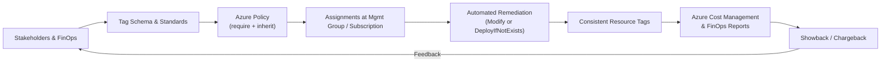

# Azure Cost Tagging & Governance 🏷️💸


> **Redaction statement:** This repository is fully redacted — no secrets, IPs, tenant IDs, subscription IDs, hostnames, or organization identifiers.  
> All values are placeholders for safe public sharing.

A clean, production-ready implementation to standardize, enforce, and report **Azure cost tags** across subscriptions and management groups.

---

## 🎯 Objectives

- Establish a consistent tag schema: `costCenter`, `owner`, `env`, `service`, `businessUnit`, `retention`.
- Enforce compliance using **Azure Policy** (require + inherit) with Audit → Modify/Deny lifecycle.
- Automate remediation for untagged resources.
- Enable showback/chargeback in **Azure Cost Management** and FinOps tooling.

---

## 📂 Repository Structure

```
.
├─ README.md
├─ RUNBOOK.md
├─ .gitignore
├─ docs/
│  ├─ OVERVIEW.md
│  ├─ ARCHITECTURE.md
│  ├─ CUTOVER_CHECKLIST.md
│  ├─ ROLLBACK.md
│  └─ SECURITY.md
└─ scripts/
   ├─ pwsh/
   │  ├─ discover-tags.ps1
   │  ├─ enforce-tags.ps1
   │  ├─ remediate-untagged.ps1
   │  └─ report-cost-by-tag.ps1
   ├─ bash/
   │  └─ discover-tags.sh
   ├─ policy/
   │  ├─ policy-definition-require-tags.json
   │  ├─ policy-definition-inherit-tags.json
   │  ├─ policy-initiative-cost-governance.json
   │  └─ policy-assignment-example.json
   └─ examples/
      └─ sample-tag-schema.json
```

---

## 🧭 Lifecycle

1. **Discover** – Inventory current tags; baseline gaps.  
2. **Design** – Finalize schema, ownership, and enforcement scope.  
3. **Build** – Author policies (require + inherit).  
4. **Test** – Audit in non-prod; validate exemptions.  
5. **Cutover** – Switch to Modify/Deny; run remediation.  
6. **Operate** – Reporting, drift checks, reviews.

---

## 🪄 Solution Overview (Mermaid)



---

## ⚙️ Getting Started

### PowerShell
```powershell
Connect-AzAccount
Set-AzContext -Subscription "SUBSCRIPTION-NAME"

# Discover tags (CSV)
./scripts/pwsh/discover-tags.ps1 -Scope "/subscriptions/00000000-0000-0000-0000-000000000000" -OutFile "./tag-inventory.csv"

# Import policy definitions
$root = "./scripts/policy"
New-AzPolicyDefinition -Name "require-tags" -Policy (Get-Content "$root/policy-definition-require-tags.json" -Raw)
New-AzPolicyDefinition -Name "inherit-tags" -Policy (Get-Content "$root/policy-definition-inherit-tags.json" -Raw)

# Create initiative & assign (example scope)
$initiative = Get-Content "$root/policy-initiative-cost-governance.json" -Raw
New-AzPolicySetDefinition -Name "cost-governance" -PolicyDefinition $initiative
New-AzPolicyAssignment -Name "cost-governance-assignment" `
  -Scope "/providers/Microsoft.Management/managementGroups/MG-CORP" `
  -PolicySetDefinition (Get-AzPolicySetDefinition -Name "cost-governance")
```

> **Safety defaults:** Scripts are read-only unless you explicitly pass `-WhatIf:$false` or `-Confirm:$false`. Review before running.

---

## 🏷️ Example Tag Schema

| Tag Key       | Example Value        | Purpose                     |
|---------------|----------------------|-----------------------------|
| `costCenter`  | `CC-1234`           | Showback/chargeback         |
| `owner`       | `email@domain.tld`  | Accountability              |
| `env`         | `prod` / `nonprod`  | Lifecycle separation        |
| `service`     | `payments-api`      | Service/app mapping         |
| `businessUnit`| `Retail`            | Financial rollups           |
| `retention`   | `90d` / `365d`      | Data lifecycle alignment    |

---

## 🔐 Security & Redaction

- This repo stores **no secrets or identifiers**. Use **Azure Key Vault** for credentials/tokens.
- Prefer **Management Group** scope for policy to minimize drift.
- Use **Modify** to inherit tags and **Deny** for missing critical tags after comms.

---

## 📘 Operations

See **RUNBOOK.md** for deployment, remediation, cutover, and rollback procedures.  
Docs in `/docs` cover architecture, checklists, and security posture.

---

## 📄 License

MIT (or your organization’s standard). Add a `LICENSE` file if required.
